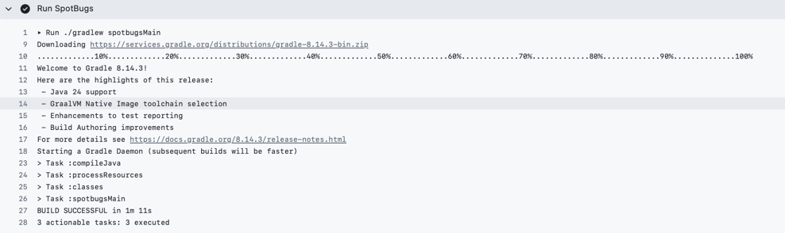
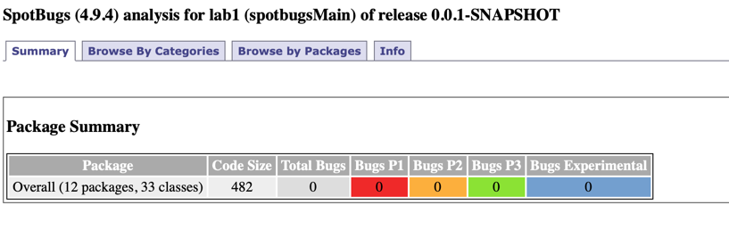
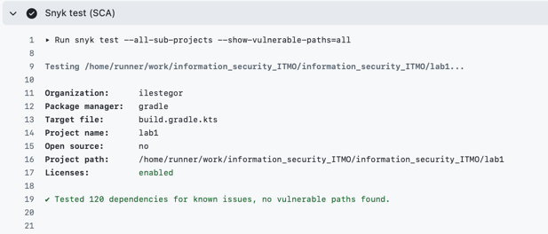

# Lab1

## Описание проекта и API

Проект для создания и хранения To-Do. Каждый пользователь может создать задачу, в которой 
будет указано ее название, дедлайн, описание задачи и ее приоритет. Каждый 
пользователь может посмотреть только свои созданные задачи

### API

#### Auth API

- **POST /api/auth/register**

**Body-параметры**

| Параметр |  Тип   | Обязательный |       Описание        |  
|:--------:|:------:|:------------:|:---------------------:|
|  login   | string |      Да      |  Логин пользователя   |   
| password | string |      Да      |  Пароль пользователя  |

**Запрос**
```json
{
  "login": "login",
  "password": "password"
}
```
**Ответ**

```json
{
  "expirationDate": "2025-09-16T17:26:21",
  "tokenType": "JWT",
  "isLoggedIn": true
}
```

**Описание**: регистрация пользователя в системе. Пользователи с одинаковыми логинами не допустимы

---

- **POST /api/auth/login**

**Body-параметры**

| Параметр |  Тип   | Обязательный |       Описание        |  
|:--------:|:------:|:------------:|:---------------------:|
|  login   | string |      Да      |  Логин пользователя   |   
| password | string |      Да      |  Пароль пользователя  |

**Запрос**

```json
{
  "login": "login",
  "password": "password"
}
```

**Ответ**

```json
{
  "expirationDate": "2025-09-16T17:26:21",
  "tokenType": "JWT",
  "isLoggedIn": true
}
```
**Описание**: авторизация пользователя в системе

---

#### Todo API

- **POST /api/todos**

**Body-параметры**

|  Параметр   |            Тип            | Обязательный |     Описание     |
|:-----------:|:-------------------------:|:------------:|:----------------:|
|  taskName   |          String           |      Да      | Название задачи  |
|  deadline   | String (yyyy-MM-dd HH:mm) |      Да      |  Дедлайн задачи  |
| description |          String           |     Нет      | Описание задачи  |
|  priority   | String(low, medium, high) |      Да      | Приоритет задачи |


**Запрос**
```json
{
  "taskName": "Buy milk",
  "deadline": "2025-09-23 13:00",
  "description": "Buy milk",
  "priority": "low"
}
```

**Ответ**
```json
{
    "id": 24,
    "taskName": "Buy milk",
    "description": "Buy milk",
    "deadline": "2025-09-23 13:00",
    "priority": "LOW",
    "created": "2025-09-16T14:12:29.437430Z",
    "isCompleted": false
}
```

**Описание**: создание новой To-Do пользователем

---

- **GET /api/todos**

**Query-параметры**

| Параметр | Тип | Обязательный |       Описание        |
|:--------:|:---:|:------------:|:---------------------:|
|   page   | int |     Нет      |    Номер страницы     |
|   size   | int |     Нет      | Размер одной страницы |


**Запрос**

```
GET /api/todos?page=1&size=20
```
**Ответ**
```json
{
    "content": [
        {
            "id": 17,
            "taskName": "test1 text",
            "description": "Hello world",
            "deadline": "2025-02-21 13:20",
            "priority": "LOW",
            "created": "2025-09-11T18:03:26.081244Z",
            "isCompleted": false
        },
        {
            "id": 18,
            "taskName": "test1 text",
            "description": "Hello world",
            "deadline": "2025-09-12 13:20",
            "priority": "LOW",
            "created": "2025-09-11T18:08:17.605310Z",
            "isCompleted": false
        },
        {
            "id": 19,
            "taskName": "test1 text",
            "description": "Hello world",
            "deadline": "2025-09-12 13:20",
            "priority": "LOW",
            "created": "2025-09-11T18:14:53.806637Z",
            "isCompleted": false
        },
        {
            "id": 24,
            "taskName": "679",
            "description": "Hello world",
            "deadline": "2025-09-17 13:20",
            "priority": "LOW",
            "created": "2025-09-16T14:12:29.437430Z",
            "isCompleted": false
        }
    ],
    "page": {
        "size": 20,
        "number": 0,
        "totalElements": 4,
        "totalPages": 1
    }
}
```

**Описание**: получение всех To-Do пользователем

## Описание реализованных мер защиты

- Для защиты от SQLi используется Spring Data JPA, который по умолчанию использует Prepared Statements
для формирования SQL запросов
- Для защиты от XSS для всех строковых полей, которые возвращаются в ответах API используется `HtmlUtils.htmlEscape()` для экранизации 
- Для всех не строковых полей происходит десериализация из Json в поля объекта, поэтому экранировать их не нужно.
- Для не строковых полей используется валидация (NotNull, NotEmpty, Size)
- При 3 неудачных попыток авторизоваться, аккаунт блокируется на время, указанное в переменной окружения

## Реализация аутентификация

При логине или регистрации пользователя выдается JWT, который кладется в Cookie (HttpOnly, Secure) для предотвращения XSS

Вся логика создания и проверки JWT находится здесь: [JwtServiceImpl](src/main/java/org/ilestegor/lab1/configuration/jwtConfig/JwtServiceImpl.java)

Секрет, который используется для подписи JWT хранится в переменной окружения и внедряется в необходимые поля классов

После логина/регистрации и установки JWT в Cookie для каждого запроса начинается работать фильтр, проверяющий
валидность токена. Реализация фильтра находится здесь: [JwtFilter](src/main/java/org/ilestegor/lab1/configuration/jwtConfig/JwtServiceImpl.java)


## Скриншоты отчетов SAST/SCA 

### SAST (SpotBugs)





### SCA (snyk)



## Ссылка на последний успешный запуск pipeline

Ссылка: [pipeline](https://github.com/ilestegor/information_security_ITMO/actions/runs/17801138318)


